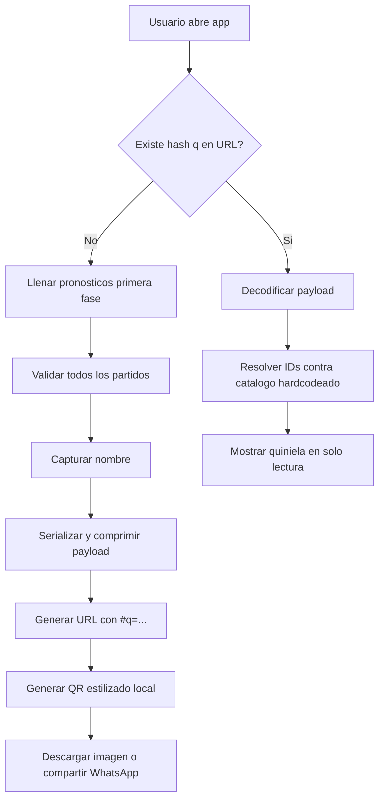

# Quiniela Mundial 2026 - Durazno

Aplicacion web para crear y compartir una quiniela de **solo primera fase** del Mundial 2026 mediante QR. El objetivo es diversion social: sin apuestas, sin login, sin base de datos, sin edicion posterior.

## Objetivo del producto

- Cualquier visitante puede llenar su quiniela de primera fase.
- Al terminar, agrega su nombre y exporta un QR.
- Cualquier persona escanea el QR y ve los resultados en modo solo lectura.
- Todo sucede en frontend, sin backend obligatorio.

## Alcance

Incluye:
- Primera fase completa.
- Pronostico por partido: resultado (local/empate/visita) y marcador.
- Exportacion a QR con nombre del creador.
- Vista de lectura desde URL QR en `https://mundial.durazno.org`.
- Compartir directo por WhatsApp y descarga de imagen QR.

No incluye:
- Eliminatorias.
- Calculo de campeon.
- Persistencia en servidor o BD.
- Cuentas, autenticacion o permisos.

## Arquitectura (sin backend)



### Stack recomendado

- Frontend: Astro + TypeScript.
- QR local estilizado: `qr-code-styling`.
- Compresion para URL: `lz-string`.
- Sin APIs de terceros para generar QR.

## Datos de partidos

Los datos de primera fase van hardcodeados en el frontend y nunca se exportan en el QR:

- `id` entero corto.
- nombre local.
- nombre visita.
- fecha/hora.
- sede.

El QR solo guarda pronosticos por `id`.

## Contrato de payload (v1)

JSON logico antes de comprimir:

```json
{
  "v": 1,
  "n": "Juan",
  "p": [[1,"L",2,1],[2,"E",0,0],[3,"V",1,3]]
}
```

Reglas:
- `v`: version de esquema.
- `n`: nombre visible (1..40 caracteres).
- `p`: lista de pronosticos.
- cada pronostico: `[idPartido, resultado, golesLocal, golesVisita]`.
- `resultado`: `L` (gana local), `E` (empate), `V` (gana visita).

Empaquetado recomendado:
1. `JSON.stringify(payload)`
2. `compressToEncodedURIComponent(...)`
3. URL final: `https://mundial.durazno.org/#q=<payload>`

## UX y diseno

- Todo el texto en espanol (enfoque Mexico).
- Mobile first.
- Flujo de 2 modos claros:
  - Crear quiniela.
  - Ver quiniela escaneada.
- QR con estilo mundialista y branding Durazno (no generico).
- Buen contraste para escaneo confiable.

### Reglas de QR estilizado

- Correccion de error alta (`H`).
- Quiet zone visible.
- Logo centrado pequeno (12-18% del area).
- Colores con contraste fuerte (fondo claro, modulos oscuros).
- Probar escaneo en iOS y Android.

## Compartir

Orden recomendado de acciones:
1. `navigator.share` si esta disponible (incluyendo imagen si es posible).
2. Fallback a abrir WhatsApp con URL de lectura.
3. Fallback final: copiar URL y boton de descarga PNG/SVG.

## Criterios de aceptacion

- Se puede llenar toda la primera fase sin errores de validacion.
- No se permite exportar si falta al menos un partido.
- El QR abre `https://mundial.durazno.org/#q=...` y muestra datos en solo lectura.
- La vista de lectura no ofrece acciones de editar ni borrar.
- El QR se puede descargar y compartir por WhatsApp.
- No se usa backend ni API externa para generar QR.

## Riesgos y mitigacion

- Payload demasiado grande para QR:
  - usar formato compacto + compresion.
  - limitar longitud de nombre.
- Escaneo dificil por exceso de estilo:
  - mantener contraste y tamano de logo dentro de limites.
- Datos corruptos en hash:
  - validar schema y mostrar error amable.

## Licencia de implementacion

Este repo sirve como contrato funcional y tecnico para que otros LLM implementen frontend y pruebas de forma consistente.
