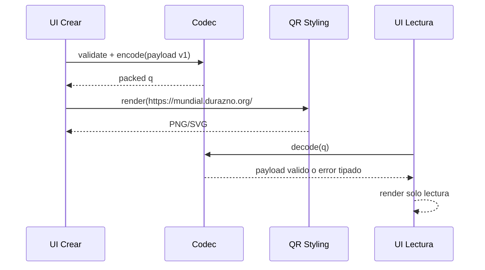

# claude.md - Contrato tecnico y reglas de datos

Este documento define el contrato tecnico que debe respetar cualquier implementacion para mantener compatibilidad de QR entre versiones.

## Rol esperado de Claude

- Definir y asegurar encode/decode estable.
- Proteger compatibilidad de schema (`v`).
- Diseñar validaciones estrictas de integridad.
- Preparar pruebas de contrato y casos borde.

No introducir backend salvo que se pida explicitamente en otra fase.

## Principios de arquitectura

- App frontend-only.
- El QR contiene toda la informacion necesaria para lectura.
- Catalogo de partidos vive hardcodeado en frontend.
- La URL de lectura siempre usa dominio oficial:
  - `https://mundial.durazno.org/#q=<payload>`

## Esquema canonico v1

```json
{
  "v": 1,
  "n": "Hugo",
  "p": [[1,"L",2,1],[2,"E",0,0],[3,"V",1,2]]
}
```

### Campos

- `v` number: version de schema, obligatorio.
- `n` string: nombre visible, obligatorio, max 40.
- `p` array: predicciones.
- item de `p`: `[id, r, gl, gv]`
  - `id` number entero positivo.
  - `r` enum `L|E|V`.
  - `gl` number entero 0..99.
  - `gv` number entero 0..99.

## Algoritmo de encode/decode (normativo)

### Encode

1. Validar payload logico.
2. Ordenar `p` por `id` ascendente (determinismo).
3. `json = JSON.stringify(payload)` sin campos extra.
4. `packed = compressToEncodedURIComponent(json)`.
5. Construir URL final con hash `#q=${packed}`.

### Decode

1. Leer `q` del hash.
2. `json = decompressFromEncodedURIComponent(q)`.
3. Parse JSON y validar schema.
4. Verificar integridad semantica:
   - IDs unicos.
   - IDs existentes en catalogo.
   - coherencia `r` contra `gl/gv`.
5. Si falla, retornar error tipado y no romper la UI.

## Errores tipados recomendados

- `ERR_Q_MISSING`
- `ERR_Q_CORRUPT`
- `ERR_SCHEMA_UNSUPPORTED_VERSION`
- `ERR_SCHEMA_INVALID`
- `ERR_PRED_DUPLICATE_MATCH`
- `ERR_PRED_UNKNOWN_MATCH`
- `ERR_PRED_INCONSISTENT_SCORE`

## Politica de compatibilidad

- `v=1` es obligatorio en esta fase.
- Si llega una version futura no soportada:
  - mostrar mensaje claro,
  - no intentar parse parcial.
- No reutilizar `v` con semantica distinta.

## Limites de tamano QR

Objetivo:
- Mantener URL final idealmente < 2500 chars para buena escaneabilidad.

Estrategias:
- Formato compacto por tuplas (no objetos por partido).
- Nombre max 40 chars.
- Compresion URI-safe.
- Evitar metadatos redundantes.

Fallback sugerido:
- Si excede umbral definido (ej. 2800 chars), advertir al usuario y reducir nombre.

## Reglas de solo lectura

Cuando hay `#q=` valido:
- Bloquear UI de edicion.
- No mostrar CTA para reexportar con cambios.
- Mostrar solo datos del payload decodificado.

## Pruebas de contrato

Crear pruebas unitarias para `lib/codec.ts` y `lib/validators.ts`.

Casos minimos:

1. Encode->Decode feliz conserva datos.
2. Determinismo: mismo input produce mismo `q`.
3. Nombre vacio invalido.
4. Resultado/marcador incoherente invalido.
5. IDs duplicados invalidos.
6. IDs fuera de catalogo invalidos.
7. Hash corrupto retorna error controlado.
8. Version no soportada retorna error especifico.

## Casos de prueba de ejemplo

```ts
const ok = { v: 1, n: "Juan", p: [[1, "L", 3, 1], [2, "E", 0, 0]] };
const badScore = { v: 1, n: "Juan", p: [[1, "L", 0, 1]] };
const dup = { v: 1, n: "Juan", p: [[1, "E", 1, 1], [1, "E", 2, 2]] };
```

## Diagrama de contrato



## Entregables tecnicos esperados

- `lib/schema.ts`: tipos y guards.
- `lib/validators.ts`: reglas de integridad.
- `lib/codec.ts`: encode/decode determinista.
- Suite de pruebas para contrato.

Con esto, cualquier QR generado por la app sera portable, legible y compatible mientras se respete `v=1`.
