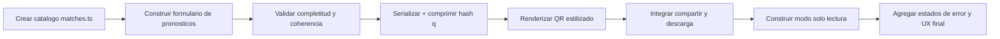

# gemini.md - Guia de implementacion frontend

Este documento define como construir la interfaz en Astro para la Quiniela Mundial 2026 de Durazno.

## Objetivo para Gemini

Implementar una app web **frontend-only** con 2 modos:

1. Crear quiniela.
2. Ver quiniela desde QR en solo lectura.

No agregar autenticacion, backend, base de datos, ni roles.

## Stack obligatorio

- Astro + TypeScript.
- Estilos: Tailwind CSS v4.
- QR local estilizado: `qr-code-styling`.
- Compresion payload: `lz-string`.

## Estructura sugerida

```text
src/
  pages/
    index.astro
  components/
    MatchCard.astro
    PredictionForm.astro
    ExportPanel.astro
    QRPreview.astro
    ReadOnlyView.astro
    ErrorState.astro
  data/
    matches.ts
  lib/
    schema.ts
    codec.ts
    qr.ts
    share.ts
    validators.ts
  styles/
    tokens.css
    app.css
public/
  brand/
    durazno-logo.svg
    ball-icon.svg
```

## Contrato funcional de UI

### Modo crear quiniela

- Mostrar partidos de primera fase con datos hardcodeados por ID (48 equipos oficiales del Mundial 2026 ya incluidos en `matches.ts`).
- **Regla estricta:** Bloquear la creación de nuevas quinielas a partir del 10 de junio de 2026 a las 23:59:59 (hora local) para evitar trampas, validado del lado del cliente.
- En cada partido capturar:
  - resultado: Local / Empate / Visita.
  - marcador: goles local, goles visita.
- Bloquear exportacion hasta completar todos los partidos.
- Al exportar pedir nombre visible (1..40 chars).
- Generar URL con hash `#q=` y QR estilizado.
- Ofrecer:
  - Compartir por WhatsApp.
  - Descargar imagen QR.
  - Copiar URL.

### Modo lectura

- Se activa si hay `#q=` valido en URL.
- Decodifica payload y resuelve IDs contra `matches.ts`.
- Muestra nombre y predicciones.
- Todo en solo lectura.
- Si hay error de decode/schema, mostrar estado de error amigable.

## Esquema de datos

Payload logico (previo a compresion):

```ts
type Resultado = "L" | "E" | "V";

type Pred = [
  idPartido: number,
  resultado: Resultado,
  golesLocal: number,
  golesVisita: number,
];

type QuinielaPayloadV1 = {
  v: 1;
  n: string;
  p: Pred[];
};
```

## Reglas de validacion

- Nombre obligatorio, trim, max 40.
- IDs unicos en `p`.
- Todos los IDs deben existir en `matches.ts`.
- Goles enteros `0..99`.
- Coherencia resultado/marcador:
  - `L` => golesLocal > golesVisita
  - `E` => golesLocal === golesVisita
  - `V` => golesLocal < golesVisita

## QR local estilizado

Usar `qr-code-styling` con:

- `type: "canvas"` para export PNG rapido.
- Correccion de error `H`.
- Quiet zone amplia.
- Colores de marca de alto contraste.
- Imagen central combinada (logo Durazno + balon) en SVG.

Parametros sugeridos:

```ts
{
  width: 1080,
  height: 1080,
  qrOptions: { errorCorrectionLevel: "H" },
  dotsOptions: { type: "rounded" },
  cornersSquareOptions: { type: "extra-rounded" },
  cornersDotOptions: { type: "dot" },
  imageOptions: { imageSize: 0.16, margin: 8 }
}
```

## Diseño visual (no generico)

- Idioma completo: espanol.
- Tema mundialista con identidad Durazno:
  - paleta esmeralda/verde azulado basada en Tailwind CSS (`emerald`, `teal`) con acentos brillantes (evitar look neutro aburrido).
  - fondos con gradiente suave y texturas ligeras.
  - tarjetas con bordes redondeados consistentes.
- Tipografia con personalidad (no default browser).
- Carga inicial rapida, layout estable, mobile-first.

## Performance y calidad

- Evitar hidratar toda la pagina; hidratar solo componentes interactivos.
- Evitar dependencias pesadas fuera de QR y compresion.
- Probar Lighthouse mobile (objetivo >= 90 en performance).
- Test manual en viewport pequeno y grande.

## Accesibilidad

- Labels claros en inputs.
- Focus visible.
- Contraste suficiente.
- Mensajes de error explicitos.
- Botones de accion con texto claro (`Compartir`, `Descargar QR`, `Copiar enlace`).

## Flujo de implementacion sugerido



## Definicion de terminado

- Dos modos completos (crear y leer).
- QR funcional en `https://mundial.durazno.org/#q=...`.
- Compartir WhatsApp y descarga funcionando.
- Sin backend, sin APIs externas.
- Textos y UX listos para usuario mexicano.
